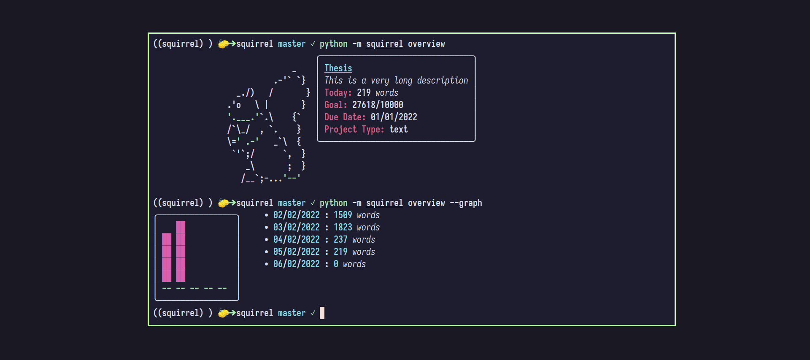

# Squirrel
**Very much a WIP project**

squirrel is a command line program that tracks you writing progress and gives you useful information and cute pictures of squirrels.

## How it works
Squirrel's design was inspired by `git`'s design (from a user perspective at least). To start a project, you have to initialize a new project in your directory of choice which will create a `.squirrel` folder structure in your directory similar to `.git` directories.
And that folder will hold information about the project in general and the word counts.
However `squirrel` is not a static program otherwise we wouldn't be able to track progress without explicit input of the user. That's why we need to have a `watch` command that will listen to any changes and update the appropriate information.

### Plugins or Project Types
As many writing project use many file formats and programs, squirrel has a plugin architecture to provide multiple ways to count words.
Which plugin will used depends on the `project-type` field.
Here are the plugins available now:
* text
* texcount

*hmm, haven't found your project type? you can write Python code? Please make a pull request :)*

## Requirement & Installation
**Tested Python versions:**
* python 3.9
* python 3.10

**Python versions:**

All pip dependencies are in the `Pipfile` file.

### Users
You can install `squirrel` with pip
```sh
pip install squirrel-writer
```

### Devs
Grab the repo, install dependencies, and voila.
```sh
git clone https://github.com/squirrel-writer/squirrel
cd squirrel
pipenv install --dev && pipenv shell
# Install the package in editable mode
# use pip with this command, so that Pipfile doesn't get modified
pip install -e .

# To run unittests
pytest
# Or use tox to run tests on multiple versions
tox
```
## Usage
### Commands
There 4 main verbs to interact with squirrel:
* init
* watch
* set
* overview

You can about their options with `-h` or `--help` option. (e.g `squirrel init -h`, etc.)
#### Init
```sh
squirrel init -n Assay --project-type text
```
#### Set
Set can be used after init to change or set fields.
```sh
squirrel set --name "English Assay" --goal 10000 -due 05/01/2022
```
#### Watch
Run this command to tell squirrel to watch your writing.
```sh
squirrel watch start --daemon
squirrel watch status
squirrel watch stop
```
### Ignore files
Similar to `.gitignore` files in git repos, you can ignore files in `squirrel` projects
by adding a `.squirrelignore` file in the root of your project.

Note: `.*`, `*~`, `*~` and `.<dir>` are ignored by default

Example file structure:
* .squirrel/
* thesis.tex
* .squirrelignore

```
# .squirrelignore file

# How to ignore files and file types
*.tmp
README.md

# How to ignore directories
tmp_dir/
```

## Contributors

### How can you help
If you're looking to help `squirrel` become better, we're always looking
for people to test, report any bugs, improve documentation,
and submit any fixes or features. 
Any contribution (even documentation) goes a long way.

### Pull Requests
PRs are welcome :). Make sure to open an issue before submitting the
PR so that everybody can chip in with their opinion.

If your PR with be changing some dependencies, don't forget to update `Pipfile.lock` as well as the dependencies in `setup.py` with `pipenv-setup`.

### Plugins
All plugins are located in `squirrel/plugin` and every plugin has its own directory which has in it the python code of the plugin (e.g `example_plugin.py`) and the `yaml` config file that tell squirrel the appropriate metadata as well as any dependencies the plugin needs to work properly. An example plugin can be found in `squirrel/plugins/example_plugin/`.

#### How to Write Plugins:

Every plugin you create must have a `get_count(files) -> int` function in their module that counts all the files and returns an int.
For squirrel to find your plugin and be able to load it, the plugin must respect a structure.

**Plugin Structure**:

There are 2 main files that make plugins work correctly. A `.py` file/module that contains the `get_count` function and a `.yaml` config file.
The folder that contains the plugin, the plugin itself (e.g python module), and the config file should have the same name.

For example, if you are creating a plugin called `markdowncount`, this is how it should be structured:

	- plugins/
		- markdowncount/
			- markdowncount.py
			- markdowncount.yaml

And the files might look like this:
```Python
# markdowncount.py
def get_count(files) -> int:
	return ...
```
```yaml
name: markdowncount
description: ....
version: 0.0.1
```
Look at this example for [more](https://github.com/squirrel-writer/squirrel/blob/plugin/squirrel/plugins/example_plugin/example_plugin.yaml) detail.


**Third-party requirements**:

If a plugin needs some thrid-party dependencies (`system` or `pip`), they must be declared in the `yaml` config file of the plugin.

`pip` or `system` dependencies can be declared this way inside a the config file:
```yaml
deps:
  sys:
   - texcount
  pip:
   - panda
```

### Testing
The testing suite is very small at the moment (about 7 tests). 
We need help in making it robust and exhaustive. Any contribution on this regard is highly appreciated.

`squirrel` is still in an experimental stage. Bugs are probably present, so any testing and bug reporting is welcome.

